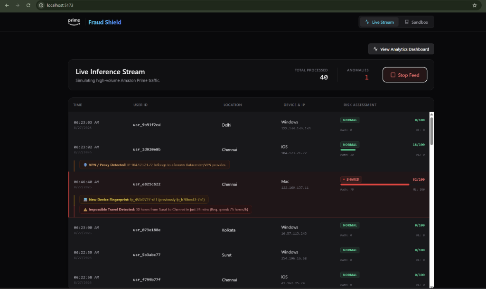
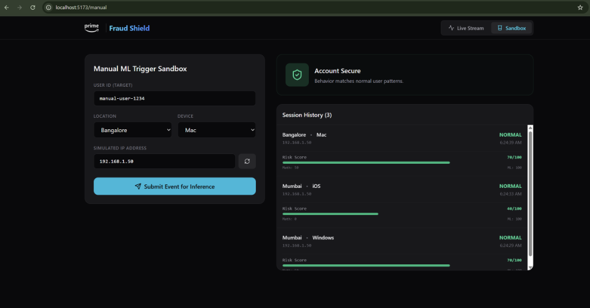
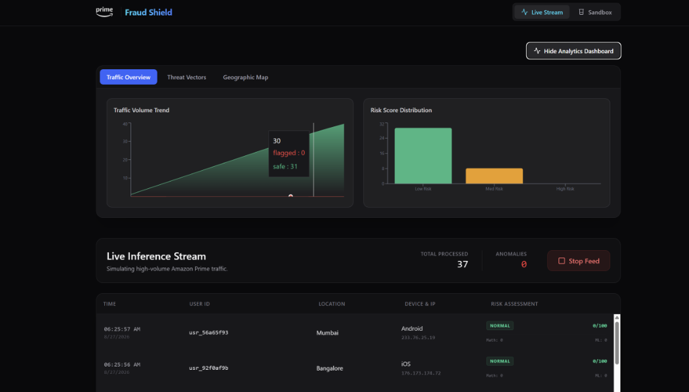
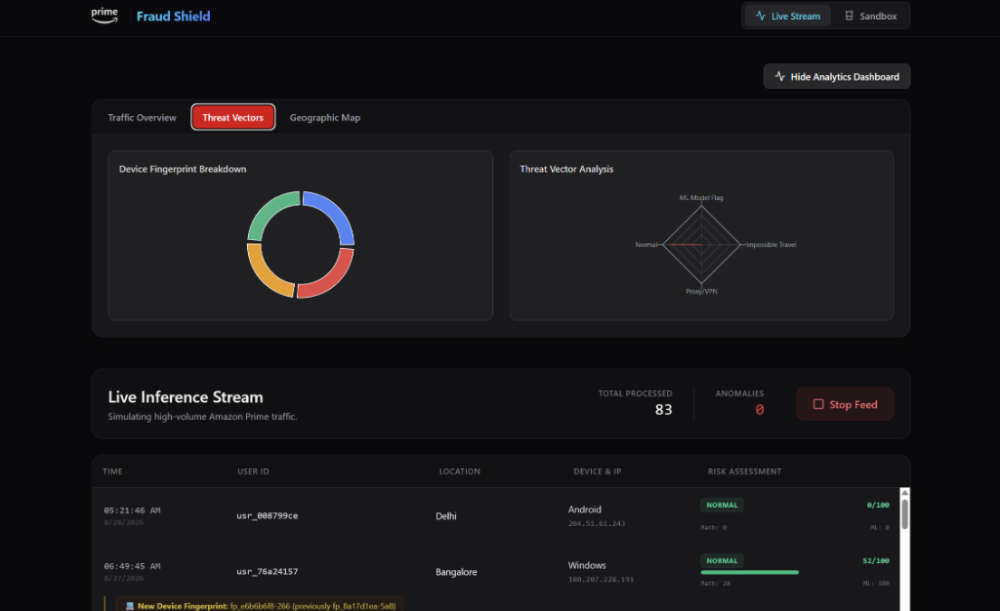
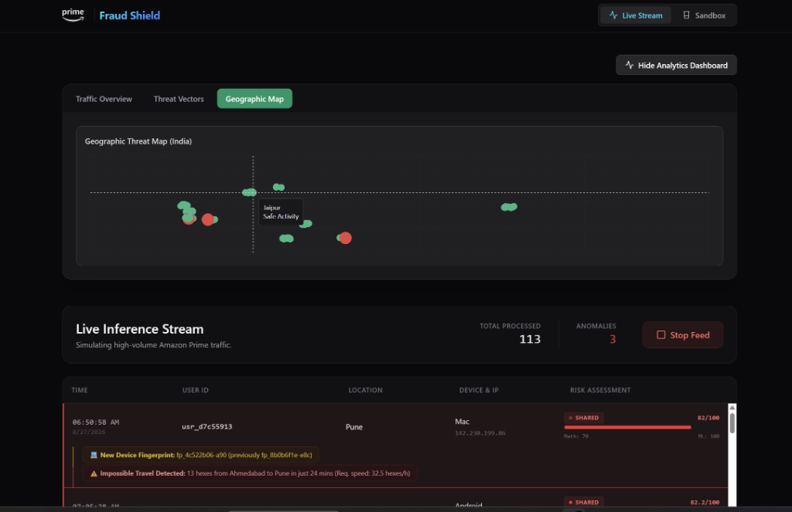

# Prime Account Sharing Detection System

A highly advanced, real-time Machine Learning and Spatial Analysis system designed to detect account sharing and fraudulent behavior in high-volume streaming platforms.

## 🚀 Features

- **Real-Time Event Processing:** A FastAPI backend capable of ingesting high-throughput login and streaming telemetry.
- **Machine Learning Engine:** Scikit-Learn Random Forest model trained on generated anomaly data to flag unusual activity patterns.
- **Spatial Math Engine (Uber H3):** Replaces expensive Haversine trigonometric distance calculations with Uber's H3 Hexagonal Grid Indexing. Distance checks are performed in O(1) time by checking grid adjacency.
- **Premium Security Dashboard:** A React/Vite frontend featuring live-updating data streams and SOC-style alerts.
- **Tabbed Visual Analytics:** Recharts integration for tracking Threat Vectors, Risk Score Distributions, Device Fingerprints, and a Geographic Threat Map.

## 🏗️ Architecture

1. **Frontend:** React + Vite + TailwindCSS + Recharts + Framer Motion
2. **Backend:** Python + FastAPI + Scikit-Learn + Uber H3 + SQLite3
3. **External Services:** ip-api.com (for Live Proxy/VPN detection during manual testing), FingerprintJS (for device identification).

## 📸 Component Showcase

*(Note: Add your screenshots to the `assets/` folder with the corresponding filenames below!)*

### 1. Live Inference Stream
The high-throughput events dashboard catching fraudulent account sharing in real-time.


### 2. Manual Testing Sandbox
Simulate targeted attacks (impossible travel, IP spoofing) against the system.


### 3. Analytics: Traffic Overview
Visualizing total request volume against average ML Risk scores.


### 4. Analytics: Threat Vectors
Donut breakdown of device fingerprint spoofing and a radar chart of anomaly properties.


### 5. Analytics: Geographic Map
A scatter plot of login events across India, detecting impossible travel jumps instantly.


## 💻 Getting Started

### 1. Start the Backend
```bash
python api.py
```
*The backend will run on http://localhost:8000. Ensure you have installed the required pip packages (`fastapi`, `uvicorn`, `scikit-learn`, `h3`, `pandas`).*

### 2. Start the Frontend
```bash
cd frontend
npm install
npm run dev
```
*The frontend will run on http://localhost:5173.*
